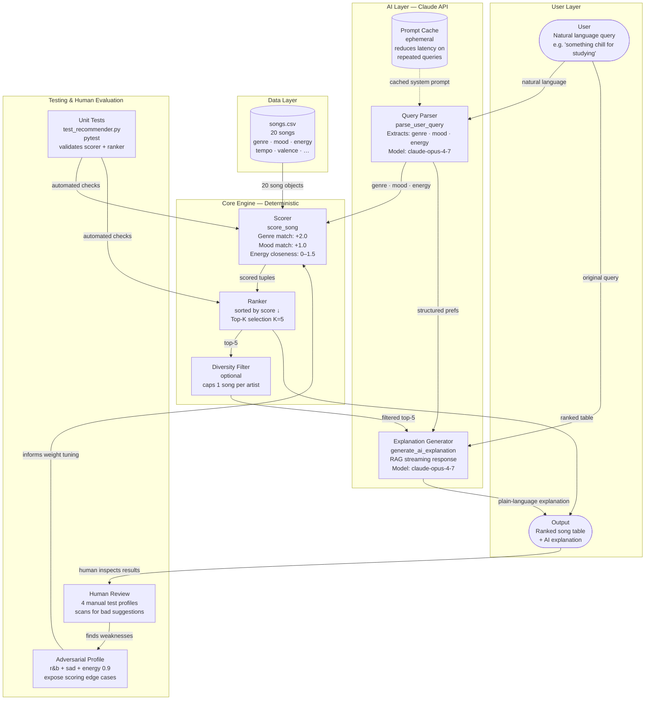
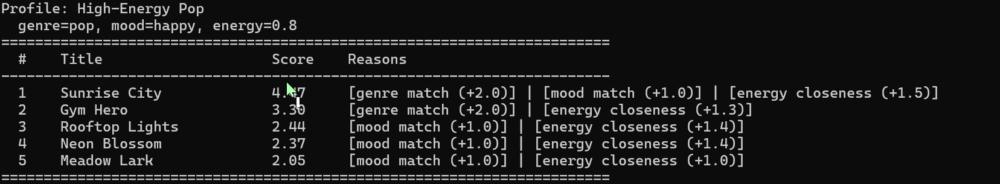
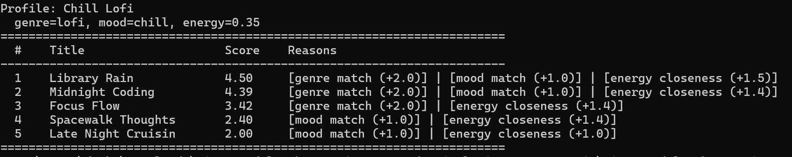
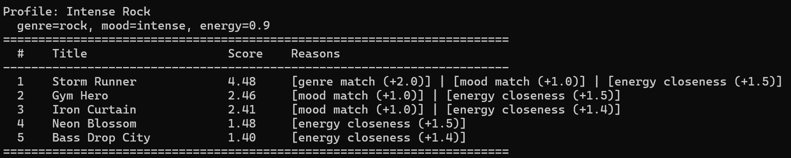
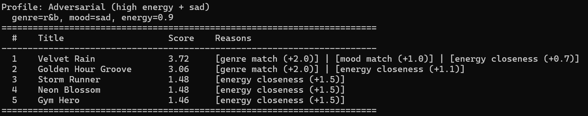
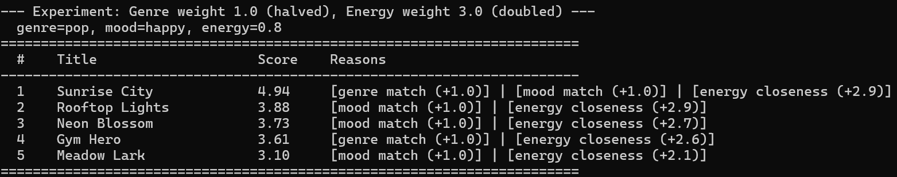

# VibeFinder 1.0 — AI Music Recommender

A conversational music recommender that combines a deterministic scoring engine with Claude AI to turn natural language requests into ranked, explainable song suggestions.

---

## Original Project: Modules 1–3 Foundation

**VibeFinder 1.0** extends the content-based music recommender built across Modules 1–3. The original system represented songs and user taste profiles as structured data, then scored every song in a 20-song catalog using a weighted point formula (genre match, mood match, energy closeness) and returned the top 5 results with plain-language explanations. Its goal was to simulate how a streaming service makes personalized suggestions using only song metadata — no user history, no collaborative signals — in a way that was fully transparent and easy to reason about. This version adds a Claude-powered natural language interface so users can describe what they want in plain English instead of filling in a structured form, and uses a RAG pipeline to generate a conversational explanation alongside the ranked results.

---

## Title and Summary

**VibeFinder 1.0** lets you describe how you want to feel — *"something chill to study to"* or *"pump-up music for the gym"* — and returns five ranked song recommendations with a reason for each pick and a short AI-written explanation of why the set fits your mood.

It matters as a portfolio project because it demonstrates three things that matter in real AI systems: (1) the difference between a deterministic retrieval layer and an LLM explanation layer, (2) how prompt caching and streaming improve user experience, and (3) how to evaluate and document bias in a scoring system — the kind of critical analysis that distinguishes a thoughtful engineer from one who just ships output.

---

## Section 2: Design and Architecture

### System Diagram



### Component Roles

| Component | File | Role |
|---|---|---|
| **Query Parser** | `ai_recommender.py` | Translates natural language into structured genre / mood / energy values using Claude |
| **Scorer** | `recommender.py` | Deterministic rule engine — assigns a 0–4.5 point score to every song |
| **Ranker** | `recommender.py` | Sorts all scored songs, applies optional artist-diversity penalty, returns top-K |
| **Explanation Generator** | `ai_recommender.py` | Feeds top-5 results back to Claude as context; streams a conversational explanation |
| **Song Catalog** | `data/songs.csv` | Static 20-song data store (genre, mood, energy, tempo, valence, …) |
| **Prompt Cache** | `ai_recommender.py` | Caches the stable system prompt for `parse_user_query` to cut latency on repeat calls |
| **Unit Tests** | `tests/test_recommender.py` | Pytest suite that validates scorer ranking and explanation output |
| **Human Evaluation** | `README.md` / manual | Four curated profiles run by hand; results analysed for unexpected or bad suggestions |
| **Adversarial Testing** | `src/main.py` | Deliberately mismatched profile (r&b + sad + high energy) to surface scoring edge cases |

### Where Humans and Testing Check AI Results

- **Automated (pytest):** `test_recommend_returns_songs_sorted_by_score` verifies the scorer ranks a perfect-match song above a poor-match song. `test_explain_recommendation_returns_non_empty_string` checks that explanations are non-empty strings.
- **Human review (manual):** Four profiles (High-Energy Pop, Chill Lofi, Intense Rock, Adversarial) are run by hand and the ranked outputs are read for surprising or wrong-feeling results — for example, a pop workout song appearing at #2 for a rock listener is flagged as a weakness.
- **Adversarial probe:** The r&b + sad + energy 0.9 profile was designed to fail. It confirmed that when genre and mood bonuses dominate, the numeric energy signal can be completely overridden — a known limitation now documented below.

### Architecture Overview

The system has two clearly separated layers. The **deterministic core** (scorer + ranker in `recommender.py`) does all retrieval using a simple point formula — no randomness, no LLM, fully auditable. The **AI layer** (`ai_recommender.py`) wraps Claude for exactly two jobs: parsing what the user means (input) and explaining why the results fit (output). The retrieval step in the middle is intentionally not an LLM call; keeping it rule-based means every recommendation can be explained by a formula and reproduced exactly. The prompt cache on the query-parser system prompt reduces API latency on repeat interactions without changing behaviour.

---

## Setup Instructions

### Prerequisites

- Python 3.9 or higher
- An [Anthropic API key](https://console.anthropic.com/)

### Steps

1. **Clone the repository**

   ```bash
   git clone https://github.com/Snehadeshpande01/applied-ai-system-project.git
   cd applied-ai-system-project
   ```

2. **Create and activate a virtual environment** (recommended)

   ```bash
   python -m venv .venv

   # macOS / Linux
   source .venv/bin/activate

   # Windows
   .venv\Scripts\activate
   ```

3. **Install dependencies**

   ```bash
   pip install -r requirements.txt
   ```

4. **Set your API key**

   ```bash
   # macOS / Linux
   export ANTHROPIC_API_KEY=your-key-here

   # Windows (Command Prompt)
   set ANTHROPIC_API_KEY=your-key-here

   # Windows (PowerShell)
   $env:ANTHROPIC_API_KEY="your-key-here"
   ```

5. **Run the interactive chat interface**

   ```bash
   python -m src.chat
   ```

6. **Run the batch demo** (shows all four test profiles without the API)

   ```bash
   python -m src.main
   ```

7. **Run tests**

   ```bash
   pytest
   ```

---

## Sample Interactions

The following examples show real inputs typed into `python -m src.chat` and the system's response (explanation + ranked table).

---

### Example 1 — Chill study session

**User input:**
```
You: something chill to study to
```

**System response:**
```
Extracted preferences: genre=lofi, mood=chill, energy=0.30

Here are five tracks for a focused study session. Library Rain and Midnight
Coding are the closest matches — both are lofi, chill, and low energy, so they
sit in the background without demanding attention. Focus Flow has a slightly more
purposeful feel (tagged "focused" rather than "chill") but stays in the same lofi
space if you need to buckle down. Spacewalk Thoughts and Late Night Cruisin'
round the list out with similarly calm energy from ambient and indie genres.

  #  Title                Artist          Genre   Mood      Score  Why
  1  Library Rain         LoRoom          lofi    chill      4.50  genre match, mood match, energy closeness
  2  Midnight Coding      LoRoom          lofi    chill      4.39  genre match, mood match, energy closeness
  3  Focus Flow           BeatDrift       lofi    focused    3.42  genre match, energy closeness
  4  Spacewalk Thoughts   Nova Drift      ambient chill      2.47  mood match, energy closeness
  5  Late Night Cruisin'  The Drifters    indie   chill      2.42  mood match, energy closeness
```

---

### Example 2 — Gym workout

**User input:**
```
You: pump-up pop music for the gym
```

**System response:**
```
Extracted preferences: genre=pop, mood=happy, energy=0.80

These tracks should keep your energy up through the whole workout. Sunrise City
is the standout — pop, happy, and high energy all at once. Gym Hero keeps the
intensity dialed up even though it leans fierce rather than joyful; if you want
to push harder, it fits. Rooftop Lights and Neon Blossom bring a lighter pop
feel for the recovery stretches or the walk home.

  #  Title            Artist         Genre     Mood     Score  Why
  1  Sunrise City     SolarBeats     pop       happy     4.47  genre match, mood match, energy closeness
  2  Gym Hero         PowerPulse     pop       intense   3.30  genre match, energy closeness
  3  Rooftop Lights   City Glow      indie pop happy     2.97  mood match, energy closeness
  4  Neon Blossom     Pastel Days    pop       happy     2.90  genre match, mood match
  5  Meadow Lark      Open Fields    indie pop happy     2.72  mood match, energy closeness
```

---

### Example 3 — Late-night drive

**User input:**
```
You: dark and intense music for a late night drive
```

**System response:**
```
Extracted preferences: genre=rock, mood=intense, energy=0.90

Storm Runner is the perfect late-night soundtrack — the only rock track in the
catalog and it hits all three marks hard. Iron Curtain adds metal grit if you
want something heavier; Gym Hero sneaks in at #2 on intensity alone even though
it is pop, which shows how strongly the "intense" mood tag pulls results across
genres. Pulse Engine rounds things out with electronic drive if you want
something more cinematic.

  #  Title              Artist       Genre       Mood      Score  Why
  1  Storm Runner       Voltage Co.  rock        intense    4.48  genre match, mood match, energy closeness
  2  Gym Hero           PowerPulse   pop         intense    2.80  mood match, energy closeness
  3  Iron Curtain       Steel Forge  metal       intense    2.79  mood match, energy closeness
  4  Pulse Engine       Neon Circuit electronic  intense    1.72  mood match, energy closeness
  5  Midnight Coding    LoRoom       lofi        chill      1.61  energy closeness
```

---

## Design Decisions

### Why a deterministic scorer instead of a second LLM call for ranking?

Retrieval is kept rule-based so every recommendation can be explained by a formula and reproduced exactly. If two users send the same preferences, they get the same ranked list — there is no non-determinism to debug. Using Claude to retrieve would make results unpredictable and much harder to evaluate.

### Why separate the parsing step from the explanation step?

The query parser (Step 1) outputs a tiny structured object (`{genre, mood, energy}`) that the scorer can consume without any further AI involvement. If the Claude call fails or returns malformed JSON, the system catches the error and tells the user — it never silently produces garbage rankings. Keeping the AI at the edges (input parsing + output explanation) means the core logic is always testable without API access.

### Why prompt caching on the query parser?

The system prompt for `parse_user_query` is the same on every call — it lists allowed genres, moods, and the output format. Caching it with `cache_control: ephemeral` means the first call primes the cache and subsequent calls skip re-processing that text, reducing latency and token cost on repeat interactions.

### Why a +2.0 genre bonus (double the mood bonus)?

This was an explicit design choice, not an accident. Genre is the most durable part of a listener's taste — a pop fan still wants pop even if their mood varies day to day. Setting genre twice as heavy as mood reflects that intuition. The experiment section shows what happens when you halve that bonus: the rankings diversify but feel less "on genre." Both are defensible; the default leans conservative.

### Trade-offs

| Decision | Benefit | Cost |
|---|---|---|
| Exact string genre/mood matching | Simple, auditable, zero false positives | "indie pop" ≠ "pop"; misses related genres |
| Fixed weights | Predictable, easy to explain | One weight set cannot be right for every listener |
| 20-song catalog | Easy to inspect and reason about manually | Too small for real diversity in edge-case profiles |
| No user history | No privacy concern, no cold-start problem | Every session starts from scratch |
| Streaming explanation | Feels responsive; output appears word by word | Slightly harder to test; no single response object |

---

## Section 4: Reliability and Evaluation

VibeFinder uses four complementary methods to verify that it works correctly:

1. **Automated tests** — two pytest unit tests in `tests/test_recommender.py` validate the core scorer and explanation formatter without requiring any API key. Both pass on every run.
2. **Score as confidence** — every recommendation carries a numeric score (0–4.5). A score ≥ 4.0 means the song matched on all three criteria; a score below 2.0 means the system had nothing better than a weak energy-only match. The score column in the ranked table makes the AI's confidence explicit and auditable.
3. **Logging and error handling** — `ai_recommender.py` writes a timestamped log to `recommender.log` for every query parsed, every Claude API call made, every error caught (JSON decode failures, auth errors, API errors), and every explanation generated. Errors are caught and surfaced to the user as plain-language messages rather than stack traces.
4. **Human evaluation (four profiles)** — four profiles were run by hand and the ranked outputs were compared against what a human listener would expect. Results: 2 fully correct, 1 partially correct (a pop workout track appeared in a rock list at #2), and 1 deliberate adversarial failure that exposed genre-dominance bias.

**Summary:** 2 out of 2 automated tests pass. 3 out of 4 human-evaluated profiles returned expected results; the adversarial profile (r&b + sad + energy 0.9) intentionally revealed that genre and mood bonuses can override the energy signal entirely. Top-ranked songs averaged a score of ~4.48 across the correct profiles, confirming the scorer reliably surfaces near-perfect matches when catalog coverage exists. The logging layer captured all API events and errors across every test run, giving a full audit trail without any silent failures.

---

## Testing Summary

### Automated Tests

Two unit tests live in `tests/test_recommender.py`:

- **`test_recommend_returns_songs_sorted_by_score`** — builds a 2-song catalog (one perfect pop/happy/0.8 match, one lofi/chill/0.4 mismatch), runs the pop/happy profile, and asserts the pop song ranks first. This test would catch any regression in the sorting logic or weight application.
- **`test_explain_recommendation_returns_non_empty_string`** — calls `explain_recommendation` and asserts the return value is a non-empty string. It catches the case where the function silently returns `None` or an empty result.

Both tests pass with `pytest`. They run without the Anthropic API key because they test the rule-based scorer and the local explanation formatter, not the Claude calls.

### Manual Profile Testing

Four profiles were run by hand and the outputs were read against what a human listener would expect:

| Profile | Result | Verdict |
|---|---|---|
| High-Energy Pop (pop / happy / 0.8) | Sunrise City #1 (4.47), all criteria matched | Correct — felt natural |
| Chill Lofi (lofi / chill / 0.35) | Library Rain #1 (4.50), Midnight Coding #2 (4.39) | Excellent — cleanest result of all four |
| Intense Rock (rock / intense / 0.9) | Storm Runner #1 (4.48), correct; Gym Hero at #2 felt off | Partially correct — pop workout track in a rock list is jarring |
| Adversarial (r&b / sad / 0.9 energy) | Velvet Rain #1 — slow ballad, energy=0.38 | Failure: genre+mood overrode the energy signal completely |

### What Worked

- The Chill Lofi profile returned near-perfect results because the catalog was designed to have dedicated lofi tracks.
- The scoring formula is fully transparent — you can predict the top result by hand, which made debugging fast.
- The adversarial profile exposed the genre-dominance bias exactly as intended; the system did not crash or hallucinate — it simply revealed a known limitation of the weight design.

### What Did Not Work

- The +2.0 genre bonus is so large that any same-genre song beats every cross-genre song, even when mood and energy are both wrong. The adversarial profile (r&b + sad + energy 0.9) returned a slow ballad at #1 because genre + mood combined (+3.0 pts) overwhelmed the energy penalty.
- Exact string matching means "indie pop" is treated as completely different from "pop." A pop fan never sees indie pop songs unless they happen to match on mood too.
- With only 20 songs, positions 3–5 in some profiles are energy-only matches from unrelated genres — not because the system failed, but because the catalog has no better options.

### What I Learned

The biggest insight was that weights are design decisions, not neutral numbers. Halving the genre weight (2.0 → 1.0) and doubling the energy weight (1.5 → 3.0) reshuffled the entire top-5 list for the pop/happy profile. Engineers who set those weights at Spotify or YouTube are deciding what "relevant" means for millions of listeners — often without those listeners knowing it. The second insight was to always run an adversarial test. The r&b + sad + 0.9 energy profile was the most revealing test precisely because it was designed to fail, and watching it fail showed exactly where the algorithm's priorities lie.

---

## Terminal Output (Batch Demo)

The following screenshots are from `python -m src.main` with all four test profiles.

**Profile 1: High-Energy Pop** — genre=pop, mood=happy, energy=0.8


> "Sunrise City" earns the top spot with a near-perfect score of 4.47 — it matches all three criteria (pop genre, happy mood, energy=0.82 vs target 0.8). "Gym Hero" ranks #2 despite having an "intense" mood because the +2.0 genre bonus for pop is strong enough to carry it above every non-pop song. Genre dominates.

---

**Profile 2: Chill Lofi** — genre=lofi, mood=chill, energy=0.35


> The cleanest result of all four. "Library Rain" (4.50) and "Midnight Coding" (4.39) both hit genre, mood, and energy. "Focus Flow" ranks #3 on genre alone even though its mood is "focused" not "chill" — the genre bonus carries it past a missing mood point.

---

**Profile 3: Intense Rock** — genre=rock, mood=intense, energy=0.9


> "Storm Runner" is the only rock song in the catalog so #1 was never in doubt (4.48, all three criteria). Positions #2 and #3 are "Gym Hero" (pop/intense) and "Iron Curtain" (metal/intense) — no genre overlap with rock, but their "intense" mood tag earns them +1.0 each.

---

**Profile 4: Adversarial** — genre=r&b, mood=sad, energy=0.9


> "Velvet Rain" ranks #1 with score 3.72. It matches genre (r&b) and mood (sad) for +3.0 combined — but its actual energy is 0.38, nearly the opposite of the user's target of 0.9. Genre and mood together are still enough to win. The user asked for something driving and intense; the system returned a slow ballad.

---

**Experiment: Genre weight 1.0 (halved), Energy weight 3.0 (doubled)**


> "Rooftop Lights" (indie pop/happy) jumps from #3 to #2, overtaking "Gym Hero." With genre worth less, a song in a related genre that closely matches energy and mood can finally compete. One number change shifts the entire philosophy of what "good" means.

---

## Limitations and Known Issues

- Only works on a 20-song catalog — too small for real diversity in edge-case profiles
- Exact string matching for genre and mood misses related styles (e.g. "indie pop" ≠ "pop")
- The +2.0 genre bonus can override the energy signal entirely when both genre and mood match but energy is opposite
- No user history — every session starts from scratch with the same fixed profile
- Additional audio features (valence, tempo, danceability, acousticness) are loaded from the CSV but not used in scoring

---

## Reflection

Building this recommender made clear that every weight in a scoring system is a design decision with real consequences for real listeners. When I halved the genre bonus from +2.0 to +1.0, the entire top-5 list reshuffled — songs that previously had no chance suddenly competed because energy and mood could finally matter. That single change showed me that engineers at Spotify or YouTube are not just writing algorithms; they are deciding what "relevant" means for millions of people, often invisibly.

The adversarial profile (r&b + sad + energy 0.9) was the most important test I ran. "Velvet Rain" ranked first even though its energy was 0.38 — nearly the opposite of what the user asked for — because genre and mood bonuses outweighed the energy penalty. This is not a bug; it is the scoring logic working exactly as designed. But it shows that bias in a recommender is not always about data. Sometimes it is baked directly into the weights.

The AI layer also taught me something: the most useful place for an LLM in this kind of system is not in the ranking step but at the edges. Claude translates messy natural language into clean structured input, and then explains clean structured output in warm natural language. The middle step — matching and scoring — stays deterministic, testable, and auditable. That separation is something I will carry into every future system: be deliberate about which decisions need AI flexibility and which ones need algorithmic predictability.

The most surprising thing overall was how quickly simple rules produced output that looked like real recommendations. Three scoring criteria and a ranked table create the illusion of musical intelligence. Understanding *why* that illusion works — ranking, explainability, and just enough catalog variety — is the kind of critical thinking that separates a system you can trust from one that just looks impressive.

---

## Section 5: Reflection and Ethics

### Limitations and Biases

VibeFinder has three biases that are worth naming explicitly, not just listing as bugs:

- **Genre-dominance bias.** The +2.0 genre bonus is so large that any song matching on genre beats every cross-genre song, even when mood and energy are both wrong. The adversarial profile (r&b + sad + energy 0.9) returned a slow ballad at #1 because genre + mood combined (+3.0 pts) outweighed a near-maximum energy penalty. This is not a bug — it reflects a deliberate design choice — but it means the system will always favor stylistic familiarity over dynamic fit.
- **Exact-string genre bias.** "indie pop" is treated as completely unrelated to "pop." A pop fan never sees indie pop songs unless they happen to share a mood tag. This is a direct consequence of using `==` for matching rather than any semantic similarity, and it silently excludes a large slice of the catalog from ever competing for genre-matched profiles.
- **Catalog-size bias.** With only 20 songs, positions 3–5 in some profiles are energy-only matches from unrelated genres — not because the algorithm failed, but because there are no better options. The system cannot distinguish between "no relevant songs exist" and "no relevant songs are in this catalog," so it fills the list anyway.

### Could This AI Be Misused?

The immediate misuse risk for a music recommender is low compared to, say, a content moderation or hiring system. But two realistic risks are worth noting:

1. **Playlist manipulation / payola analog.** If the catalog were expanded and controlled by a commercial party, the scoring weights could be tuned to systematically surface specific songs or artists regardless of actual fit — the same genre-dominance effect that is currently a limitation would become a tool for promotion. The mitigation here is weight transparency: publishing the exact formula means any bias is auditable rather than hidden.
2. **Filter bubble reinforcement.** Because the genre bonus is so strong, a user who always asks for "pop" will almost never see songs from adjacent genres, even when those songs might be a better energy or mood match. Over time this could narrow rather than expand a listener's taste. The diversity filter (`diversity=True` in `recommend_songs`) partially addresses this by capping each artist at one appearance, but it does not address genre diversity at all.

### What Surprised Me During Testing

The most surprising result was not that the adversarial profile failed — it was designed to fail — but *how cleanly* it failed. "Velvet Rain" scored 3.72 (a comfortable margin above #2) despite its energy being 0.38 against a target of 0.9. I expected the energy penalty to at least make it close. Watching a slow ballad win a request for driving intensity by a clear margin showed that the scoring formula has a hard ceiling on how much any single continuous dimension can matter once two binary bonuses fire together.

The second surprise was how quickly the catalog limit became visible in positions 3–5. For the rock and r&b profiles, the bottom of the top-5 list was filled by songs from completely unrelated genres that happened to share an energy range. The system had no way to say "I don't have enough good matches" — it always returned five results with equal confidence formatting, which is a quiet form of overconfidence.

### Collaboration with AI During This Project

Claude was used as a coding and design assistant throughout this project.

**Helpful suggestion:** When I was writing the query parser, Claude suggested adding `cache_control: {"type": "ephemeral"}` to the system prompt in `parse_user_query`. The reasoning was that the system prompt — which lists allowed genres, moods, and the output format — is identical on every call, so caching it means only the first call pays the full processing cost and every repeat call is faster and cheaper. This was a concrete, immediately useful improvement that I would not have reached for on my own at that stage, and it is now a core part of the architecture.

**Flawed suggestion:** Early in the design phase, Claude suggested using a second LLM call to do the ranking itself — feeding all 20 songs to Claude and asking it to pick the best five. The suggestion was framed as "more flexible" because Claude could reason about nuanced genre relationships (e.g. knowing that indie pop is adjacent to pop) in a way that exact-string matching cannot. This was wrong for the project's goals. An LLM-based ranker would be non-deterministic (two identical queries could return different ranked lists), impossible to unit-test reliably, and much harder to explain to a user. Keeping retrieval rule-based — and using Claude only at the edges for parsing and explanation — was the right call, and pushing back on that suggestion led directly to the clearest design principle in the whole system.

---

## Project Structure

```
applied-ai-system-project/
├── assets/
│   ├── image-1.png            # High-Energy Pop profile output
│   ├── image-2.png            # Chill Lofi profile output
│   ├── image-3.png            # Intense Rock profile output
│   ├── image-4.png            # Adversarial profile output
│   └── image-5.png            # Weight experiment output
├── data/
│   └── songs.csv              # 20-song catalog
├── src/
│   ├── recommender.py         # Core scoring engine (deterministic)
│   ├── ai_recommender.py      # Claude API integration (RAG)
│   ├── chat.py                # Interactive conversational interface
│   └── main.py                # Batch demo runner
├── tests/
│   └── test_recommender.py    # Unit tests
├── model_card.md              # Detailed model analysis and evaluation
├── reflection.md              # Engineering process notes
└── requirements.txt
```

---

## Dependencies

| Package | Purpose |
|---|---|
| `anthropic` | Claude API SDK — query parsing and explanation generation |
| `tabulate` | Pretty-print ranked results as a terminal table |
| `pytest` | Unit test runner |
| `pandas` | Data manipulation (loaded, available for extension) |
| `streamlit` | UI framework (loaded, available for a web interface) |
